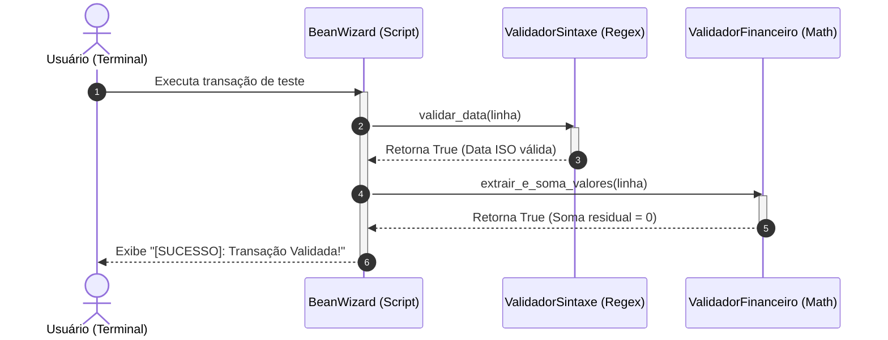

# Diagramas de Arquitetura e Modelagem UML - BeanWizard

Este documento reúne a modelagem do assistente validador utilizando a especificação oficial da UML.

---

## 1. Diagrama de Componentes (UML Component Diagram)

```mermaid
flowchart LR
    subgraph Interface_Usuario [Interface do Usuário]
        CLI[Interface de Linha de Comando - CLI]
    end

    subgraph Core [Core do Sistema - BeanWizard]
        BW[Gerenciador BeanWizard]
        VS[Componente Validador de Sintaxe]
        VF[Componente Validador Financeiro]
    end

    subgraph Engine_Externa [Mecanismo de Terceiros]
        EB[Engine Beancount]
    end

    CLI -->|Envia linha_transacao| BW
    BW -->|Usa| VS
    BW -->|Usa| VF
    BW -->|Chama para validação final| EB
 ```

## 2. Diagrama de Classes (UML Class Diagram)

```mermaid
classDiagram
    class BeanWizard {
        +str linha_transacao
        +validar_transacao_beancount(linha_transacao: str) bool
    }

    class ValidadorSintaxe {
        +str padrao_data
        +checar_regex_data(linha: str) bool
    }

    class ValidadorFinanceiro {
        +list valores
        +checar_balanco_dupla_entrada(linha: str) bool
    }

    BeanWizard ..> ValidadorSintaxe : depende de
    BeanWizard ..> ValidadorFinanceiro : depende de
```

## 3. Diagrama de Sequência (UML Sequence Diagram)


